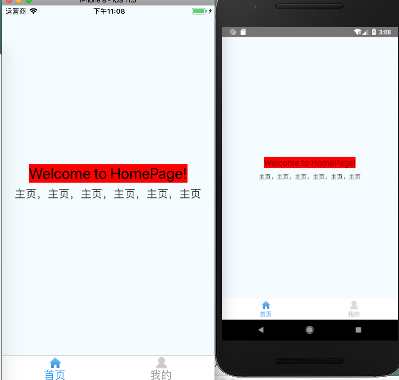
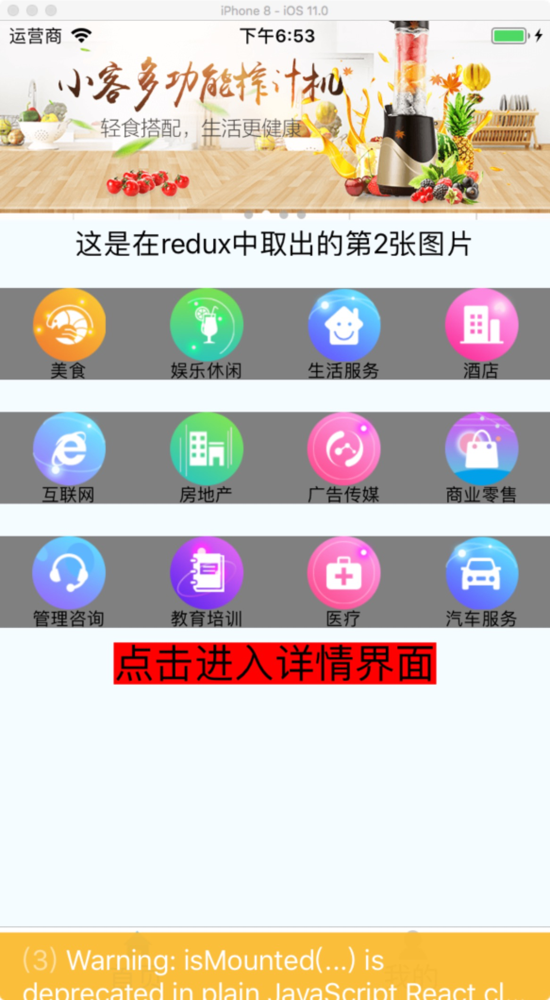
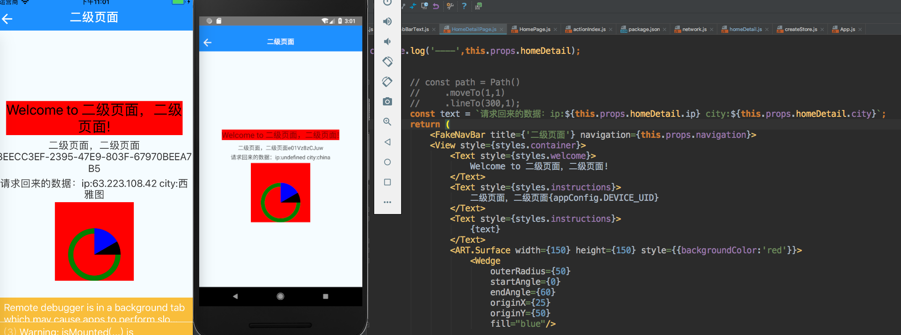
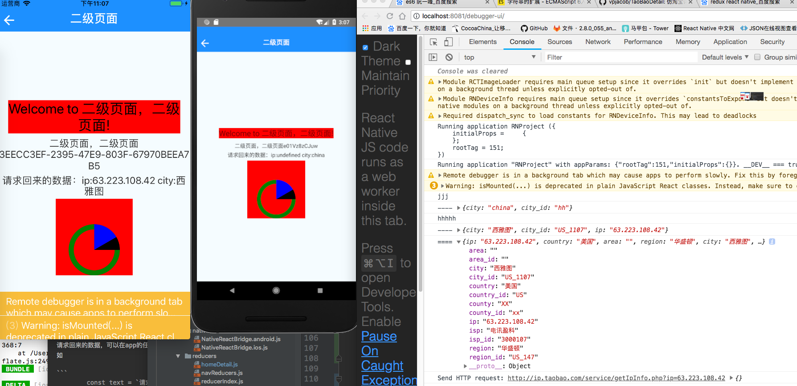

# react-native

####使用React-native-navigation和Redux axios

当使用redux 需要在action 添加 success 和 error 添加 reducer。可以通过this.props.reducer拿到网络请求的值。


###目录结构

- android   	`安卓原生代码`
- ios			`ios原生代码`
- src			`rn代码`
	- action	`rn中的动作和网络请求动作，包含不限于redux动作`
	- compoment `rn中各个界面，继承于basepage`
	- config	`设备手机基础信息`
	- constants	`静态的常量颜色等`
	- container	`如果界面用到reducer需要写container`
	- img			`图信息`
	- native `rn和ios桥接文件，方便js中调用`
	- reducers	`将reducer拆分出小的reducer`
	- screen	`路由注册列表，跳转界面需要再次写`
	- store	`将reducer结合成一个大的reducer`
	- styles	`存放界面中的style，解耦`
	- utils	`存放工具类的`
	- weight	`小的组件`
- package.json 	`使用rn的第三方库`
- App.js	
- index.js	`ios调用rn的第一个文件，code-push在此写`

## long long ago效果概览




##Lodash使用，来构成小图标排列
```
会得到一大长串的数组，有12个对象，
首先使用chunk，将数组隔成4个4个的。一共3个二维数组

    items = (items)=>{
		//12个对象分隔成4个的二维数组
       return( _.map(_.chunk(items,4),(value ,index)=>{

            return <View key={index} style={{flexDirection:'row',marginTop:c.screenPadding}}>
					//将二维数组再次遍历
                {_.map(value,(v,i)=>{
                    return (
                        <View key={i} style={{flex:1,backgroundColor:'gray',marginTop:c.screenPadding,alignItems:'center'}}>

                            <Image style={{width:c.fixPx(100),height:c.fixPx(100)}} source={{url:"http://www.ppke.cn" + v.image}}/>
                            <Text style={{textAlign:'center',fontSize:c.fixPx(18)}}>{v.name}</Text>
                        </View>
                        )
                })}
            </View>
        })
       )
    }

```





##Redux的使用

使用了redux-thunk
用来处理异步action，如果是函数，返回一个递归操作

```
export default function thunkMiddleware({ dispatch, getState }) {
       return next => action => {
          if (typeof action === 'function') {
              return action(dispatch, getState);
          }
        return next(action);
      };
 }
// redux-thunk的源码

```

同步action与异步action最大的区别是：
同步只返回一个普通action对象。而异步操作中途会返回一个promise函数。当然在promise函数处理完毕后也会返回一个普通action对象。thunk中间件就是判断如果返回的是函数，则不传导给reducer，直到检测到是普通action对象，才交由reducer处理。

举例说明：
我们有个动作，执行网络请求，请求网络地址接口

```
export const testAction = makeAsyncAction({
    url:'http://ip.taobao.com/service/getIpInfo.php?ip=63.223.108.42',success:actionTypes.HAHA,error:actionTypes.ERROR
})

```

actionindex中定义这个动作请求，成功和失败的type定义。。然后走network，dispatch 分发动作。当成功分发成功，失败分发失败。
然后到达reducer中。具体到达那个reducer是看，在container中绑定了哪一个reducer。
对每个传过来的action进行switch，每个action都需要返回一个state对象，如果不需要变动，则返回原对象（switch中的default返回值）。需要变动，则返回一个新的state, 可以看到返回的对象跟原始对象都会有一些字段的差别，或者请求完的数据，界面根据新的数据做出变更

reducer/index
是将一个大的state，切割成一些小的state，便于解耦，当一个小的state改变的时候其他的不会刷新

请求回来的数据，可以在app的任何地方都能调取到，前提要connect到，state属性和界面。
如

```
        const text = `请求回来的数据：ip:${this.props.homeDetail.ip} city:${this.props.homeDetail.city}`;

<Text style={styles.instructions}>
                    {text}
                </Text>

```


##RN轻松的在不同界面使用这state


APP.js

```
import createStore from './src/store/createStore';
export const store = createStore();
import {Provider} from 'react-redux';
import AppWithNavitionState from './src/screen/AppWithNavigationState';
import React, {Component} from 'react';
import * as appConfig from './src/config/appConfig';

type Props = {};
export default class App extends Component<Props> {

    componentWillMount() {
        // appConfig.initAppNativeStatusBarHeight();
    }

    render() {
        return (
            <Provider store={store}>
                <AppWithNavitionState/>
            </Provider>
        );
    }

```
将store传递给provider。


